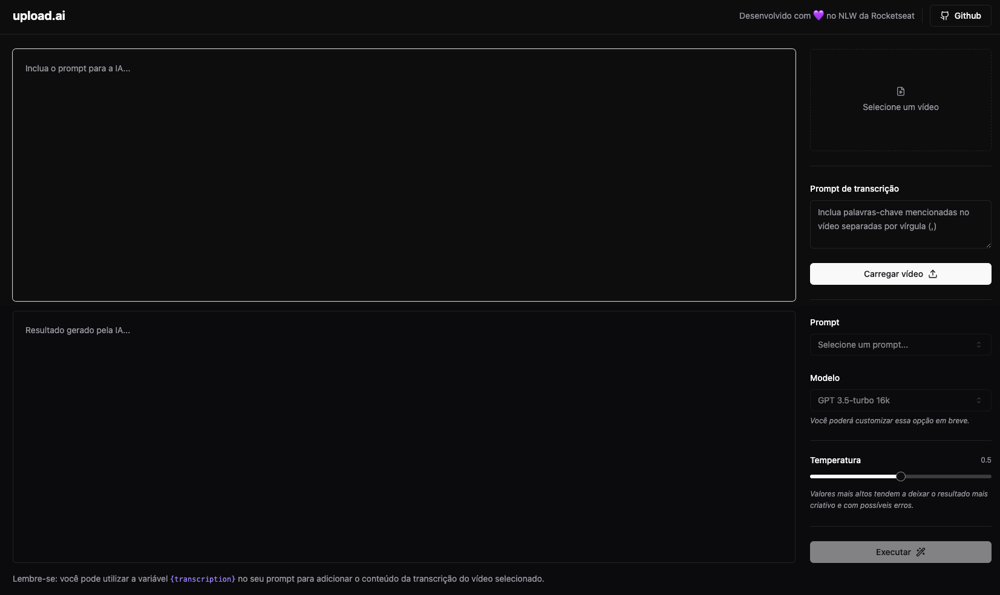

# 🎬 Upload.ai



O **Upload.ai** é uma ferramenta inteligente que revoluciona o processo de upload de vídeos para o YouTube, adicionando uma camada de inteligência artificial que automatiza a criação de conteúdo otimizado.

## 🚀 Funcionalidades

- **Upload de vídeos** com conversão automática para áudio
- **Transcrição automática** usando o modelo Whisper da OpenAI
- **Geração de títulos** com diferentes níveis de "clickbait"
- **Criação de descrições** otimizadas para SEO
- **Geração de capítulos** com timestamps automáticos
- **Exportação em PDF** do conteúdo do vídeo
- **Interface moderna** e responsiva

## 🛠️ Tecnologias Utilizadas

- **React 18** - Biblioteca para construção da interface
- **TypeScript** - Tipagem estática para JavaScript
- **Vite** - Build tool e dev server
- **Tailwind CSS** - Framework CSS utilitário
- **Radix UI** - Componentes acessíveis e customizáveis
- **FFmpeg WASM** - Processamento de vídeo no navegador
- **Axios** - Cliente HTTP para requisições
- **Lucide React** - Ícones modernos

## 📋 Pré-requisitos

Antes de começar, certifique-se de ter instalado:

- [Node.js](https://nodejs.org/) (versão 16 ou superior)
- [Yarn](https://yarnpkg.com/) ou [npm](https://www.npmjs.com/)

## 🔧 Instalação

1. **Clone o repositório**
   ```bash
   git clone https://github.com/seu-usuario/upload-ai.git
   cd upload-ai
   ```

2. **Instale as dependências**
   ```bash
   yarn install
   # ou
   npm install
   ```

3. **Configure as variáveis de ambiente**
   
   Certifique-se de que o backend da aplicação esteja rodando na porta 3333, ou ajuste a URL da API em `src/App.tsx`:
   ```typescript
   api: 'http://localhost:3333/ai/complete'
   ```

## 🚀 Como Usar

### Desenvolvimento

Para iniciar o servidor de desenvolvimento:

```bash
yarn dev
# ou
npm run dev
```

A aplicação estará disponível em `http://localhost:5173`

### Build para Produção

Para criar uma build otimizada:

```bash
yarn build
# ou
npm run build
```

### Preview da Build

Para visualizar a build de produção:

```bash
yarn preview
# ou
npm run preview
```

## 📖 Fluxo da Aplicação

1. **Upload do Vídeo**: O usuário faz upload de um arquivo de vídeo
2. **Conversão para Áudio**: O app converte o vídeo em áudio utilizando WASM
3. **Transcrição**: O áudio é convertido para texto usando o modelo Whisper
4. **Revisão**: A transcrição é exibida para correção manual se necessário
5. **Geração de Conteúdo**: O app gera:
   - Três opções de títulos com diferentes níveis de "clickbait"
   - Descrição otimizada para o vídeo
   - Capítulos com timestamps baseados na transcrição
   - Material em PDF com o conhecimento do vídeo

## 🎯 Como Usar a Interface

### 1. Upload do Vídeo
- Clique na área de upload ou arraste um arquivo de vídeo
- Aguarde o processamento e transcrição automática
- Revise e edite a transcrição se necessário

### 2. Seleção do Prompt
- Escolha um dos prompts pré-definidos no menu suspenso
- Ou crie seu próprio prompt personalizado
- Use a variável `{transcription}` para incluir o conteúdo transcrito

### 3. Configuração da IA
- **Modelo**: GPT 3.5-turbo 16k (mais opções em breve)
- **Temperatura**: Ajuste a criatividade da IA (0 = mais conservador, 1 = mais criativo)

### 4. Execução
- Clique em "Executar" para gerar o conteúdo
- Aguarde o processamento da IA
- Copie o resultado gerado

## 🎨 Personalização

### Adicionando Novos Prompts

Para adicionar novos prompts, edite o componente `PromptSelect` em `src/components/prompt-select.tsx`.

### Modificando Estilos

O projeto usa Tailwind CSS. Para personalizar:
- Edite `tailwind.config.ts` para temas globais
- Modifique classes diretamente nos componentes
- Use `src/index.css` para estilos globais

## 🤝 Contribuindo

1. Faça um fork do projeto
2. Crie uma branch para sua feature (`git checkout -b feature/AmazingFeature`)
3. Commit suas mudanças (`git commit -m 'Add some AmazingFeature'`)
4. Push para a branch (`git push origin feature/AmazingFeature`)
5. Abra um Pull Request

## 📝 Scripts Disponíveis

- `yarn dev` - Inicia o servidor de desenvolvimento
- `yarn build` - Cria build de produção
- `yarn preview` - Visualiza a build de produção
- `yarn lint` - Executa o linter ESLint

## 🐛 Solução de Problemas

### Erro de CORS
Se encontrar erros de CORS, certifique-se de que o backend esteja configurado para aceitar requisições do frontend.

### Problemas com FFmpeg
O FFmpeg WASM pode ser lento em alguns navegadores. Para melhor performance, use Chrome ou Firefox atualizados.

### Transcrição Incorreta
A qualidade da transcrição depende da qualidade do áudio. Para melhores resultados:
- Use vídeos com áudio claro
- Evite ruídos de fundo
- Fale de forma clara e pausada

## 📄 Licença

Este projeto foi desenvolvido durante o NLW (Next Level Week) da [Rocketseat](https://rocketseat.com.br).

---

<div align="center">
  Desenvolvido com 💜 no NLW da <a href="https://rocketseat.com.br">Rocketseat</a>
</div>
